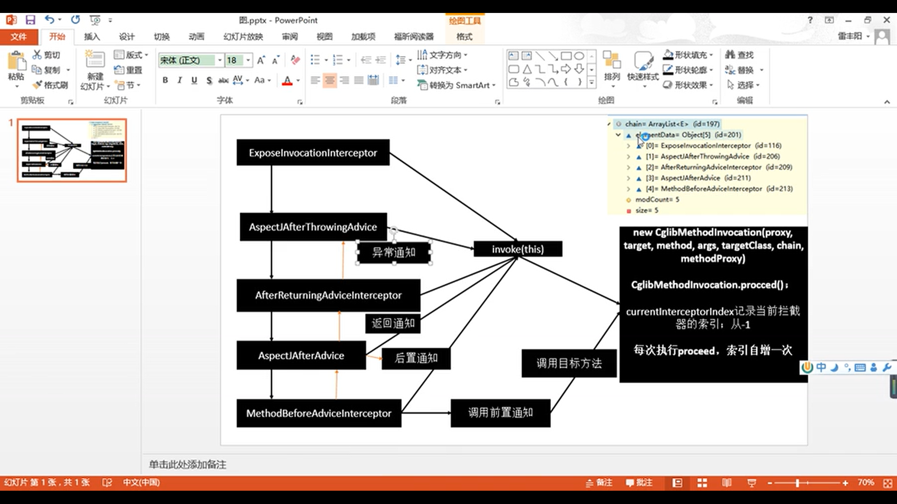

## spring注解 


### 常用注解

- 注解与xml标签映射关系
@Configuration==<beans>;
@Bean==<bean>;
@ComponentScan(value="package path")==<context:component-scan> 扫描指定路径下的spring bean组件.
@Configuration中@bean使用方法名作为bean在上下文中的名称.可以使用@Bean(name="alias")指定别名


- @Scope:bean作用域
```
prototype: 多实例.ioc容器启动时不会创建对象,只有每次请求时调用创建方法;    
singleton:单实例.ioc容器启动时创建对象,并放入ioc容器中;后续每次获取都从缓存中取    
request: 同一次请求创建一个实例    
session: 同一个session创建一个实例
```

- @Lazy 懒加载:    

单实例bean,默认在容器启动时创建;    
懒加载:容器启动时不创建对象,第一次使用bean时创建对象并初始化;

- 向容器中注册组件方式

1) 包扫描+组件注解(@Controller@Service@Repository@Component)    
2) @Bean[引入第三方包内组件]
3) @Import[快速给容器中导入组件]    
```
	1 @Import:容器会自动注册该组件,id默认是全类名    
	2 ImportSeletor: 返回需要导入的组件的全类名数组    
	3 ImportBeanDefinitionRegister: 手动注册bean到容器    
```
4) 使用spring提供的FactoryBean
```
1 默认获取FactoryBean.getObject()创建的对象    
2 获取FactoryBean,需要id前加&    
	Object bean = application.getBean("colorFactoryBean")
	bean.getgetClass():获取的是FactoryBean中getObject方法定义的具体创建对象的类型
	Object bean = application.getBean("&colorFactoryBean")
	bean.getgetClass():获取的是FactoryBean自身的类型	
```

- 读取配置文件    
```
@PropertySource(value={""})== <context:property-placeholder location=""/>读取外部配置文件中的k/v保存都运行的环境变量中
		配置@Value注解进行取值
context.getEnvironment().getProperty("配置文件key");
```

@Value赋值
```
1 基本数值    
2 写spel: #{}    
3 写${}:取配置文件properties中的值(运行时环境变量里的值)
```

- 自动注入/自动装配

CarService {
	@Autowired/@Resource/@Inject
	@Qualifier("carDaoId")
	CarDao carDao;
}

@Autowired/@Resource/@Inject: 自动装配注解,进行自动装配的标识    
CarDao:自动装配类型    
carDao: 自动装配对象属性名称    
@Qualifier: 多个可装配类时,指定生效的装配类    
carDaoId: 自动装配对象组件id

@Autowired:spring原生注解
```
1) 默认优先按照类型去容器中找对应组件:ApplicationContext.getBean(CarDao.class)
2) 如果找到多个相同类型的组件,再按属性名称作为组件id去容器中查找:ApplicationContext.getBean("carDao")
3) @Qualifier("carDao"):执行装配组件id,不使用属性名装配
4) 自动装配(@Autowired)默认必须有注入类,否则报错
   1) 可以使用@Autowired(required=false)
5) @Primary:自动装配时,默认首选的bean.@Qualifier也是一种优先级bean指定注解
```
@Resource(JSR250),@Inject(JSR330):java规范注解

@Resource
```
1) 用于自动装配,默认按组件名称进行装配
2) 不支持spring原始注解.即不支持@Primary
3) 注入对象必须存在,不支持required=false
```

@Inject
```
1) 需要引入javax.inject依赖    
2) 注入对象必须存在,不支持required=false
```

- 自动注入方式
  
AutowiredAnnotationBeanPostProcessor:解析完成自动装配功能
@Autowired进行自动注入的方式:构造器,参数,方法,属性;都是从容器中获取参数组件的值

1) 方法上注入:方法参数上是需要注入的bean,参数从容器中获取;@Autowired可省略
2) 构造器注入:如果构造器只有一个有参构造器,@Autowired可省略
3) 参数注入:@Autowired不可省


- 激活配置环境

@Profile:组件在指定环境下才注册到容器中.默认是default,不进行注册限制    

1) 加了环境标识的bean,只有在该环境下才进行bean注册
2) 协助配置类上,指定环境下才加载该配置类

激活方式:    
1) -Dspring.profiles.active=test
2)applicationContext.getEnvironment().setActiveProfiles("dev")

- 配置文件标识符替换类
org.springframework.core.env.AbstractPropertyResolver

### bean的生命周期

```
bean创建->初始化->销毁
```
- 容器管理bean的生命周期:    

支持自定义初始化和销毁方法;    
容器在bean进行到当前声明周期的时候调用自定义生命周期方法    
```
构造(对象创建)	
	单实例:在容器启动时创建对象    
	多实例:在每次获取时创建对象


BeanPostProcessor.postProcessBeforeInitialization
初始化:
	对象创建完成;赋值;调用初始化方法    
BeanPostProcessor.postProcessAfterInitialization

销毁:    
	单实例:容器关闭时    
	多实例:容器不会管理这个bean,不会调用销毁方法;由jdk进行垃圾回收

```
1) 指定初始化和销毁方法:    
   1) 通过@Bean指定init-method,destroy-method
2) 通过让bean实现InitializingBean(定义初始化逻辑),DisposableBean(定义销毁逻辑)        	
3) 使用JSR250:
   1) @PostConstruct: 在bean创建完成并属性赋值完成后,执行初始化方法    
   2) @PreDestroy:在容器销毁bean前执行
4) BeanPostProcessor:bean后置处理器
   1) 在bean初始化前后进行一些处理
   2) postProcessBeforeInitialization():初始化前执行
   3) postProcessAfterInitialization():初始化后执行

- BeanPostProcessor

spring中应用点:    
	bean赋值;注入其他组件;@Autowired;声明周期注解功能;@Async;xxxBeanPostProcessor     


原理:

在初始化方法的前后循环遍历对应的方法.    
	初始化前置操作:applyBeanPostProcessorsBeforeInitialization(wrappedBean, beanName);
		遍历得到容器中所有的BeanPostProcessor实现方法postProcessBeforeInitialization()    
		一旦返回null,跳出for循环,不再执行后面的applyBeanPostProcessorsBeforeInitialization();
	进行初始化:invokeInitMethods(beanName, wrappedBean, mbd);    
	初始化后置操作:applyBeanPostProcessorsAfterInitialization(wrappedBean, beanName);

具体触发方法:org.springframework.beans.factory.support.AbstractAutowireCapableBeanFactory#initializeBean(java.lang.String, java.lang.Object, org.springframework.beans.factory.support.RootBeanDefinition)

populateBean(beanName, mbd, instanceWrapper):进行bean属性赋值    
initializeBean:    
```
applyBeanPostProcessorsBeforeInitialization(wrappedBean, beanName);
invokeInitMethods(beanName, wrappedBean, mbd); 
applyBeanPostProcessorsAfterInitialization(wrappedBean, beanName);
```


- spring扩展:自定义组件

自定义组件想要使用spring容器底层的一些组件(ApplicationContext,BeanFactory,xxx)

1) 自定义组件实现xxxAware:在创建对象时,会调用接口规定的方法注入相关组件
2) 把spring底层一些组件注入到自定义bean中
   1) xxxAware: 功能使用xxxProcessor实现:ApplicationContextAware -> ApplicationContextAwareProcessor


### AOP

在程序运行期间动态的将某段代码切入到指定方法指定位置进行运行的编程方式.    
优点:解耦.解决非业务代码与业务代码的耦合问题;    
缺点:粒度取决与方法,无法做到更细粒度的控制.

- 使用方式

1) 导入aop模块:spring aop(spring-aspects)
2) 定义要给业务逻辑类(CarService):在业务逻辑运行时进行非业务代码执行(日志等)
3) 声明切面类(@Aspect):切面里方法需要动态告知CarService.run()方法运行点,给切面类的目标方法标注合适何地运行(通知注解)
通知方法:
```
前置通知@Before:在目标方法执行前切入.
后置通知@After:在目标方法执行后切入.
返回通知@AfterReturning:在目标方法正常返回后切入.
异常通知@AfterThrowing:在目标方法异常后切入.
环绕通知@Around:动态代理,手动推进目标方法运行
```
4) 将切面类和业务逻辑类加入容器中
5) 启用切面.给配置类中加@EnableAspectJAutoProxy

#### 常用注解

@Aspect:声明是切面类.类注解    
@Pointcut("execution(public int com.ll.service.*)"):公共切入点.方法注解        
@Before("pointCut()"):切点表达式(指定在哪个方法切入[可以使用公告切入点]).方法注解        
@After:在目标方法执行后切入.    
@AfterReturning:在目标方法正常返回后切入.    
@AfterThrowing:在目标方法异常后切入.    
@Around:jointPoint.procced()    

JoinPoint必须在自定义切面方法的第一个参数,否则无法识别

#### AOP原理

看给容器中注册了什么组件,这个组件什么时候工作,这个组件的功能是什么?

- @EnableAspectJAutoProxy

@Import(AspectJAutoProxyRegistrar.class):给容器中导入AspectJAutoProxyRegistrar    
	利用AspectJAutoProxyRegistrar自定义给容器中注册bean    
	内部实现类是:AnnotationAwareAspectJAutoProxyCreator

- AnnotationAwareAspectJAutoProxyCreator

AnnotationAwareAspectJAutoProxyCreator
	-> AspectJAwareAdvisorAutoProxyCreator
		-> AbstractAdvisorAutoProxyCreator
			-> AbstractAutoProxyCreator
				-> SmartInstantiationAwareBeanPostProcessor,BeanFactoryAware
			实现了后置处理器(bean初始化前后要做的事情),自动装配BeanFactory

核心方法:    
AbstractAutoProxyCreator.setBeanFactory:自动装配    
AbstractAutoProxyCreator.postProcessBeforeInstantiation:后置处理器前方法    
AbstractAutoProxyCreator.postProcessAfterInitialization:后置处理器后方法    
AbstractAdvisorAutoProxyCreator.setBeanFactory()->initBeanFactory()    
AnnotationAwareAspectJAutoProxyCreator.initBeanFactory()


- 创建和注册AnnotationAwareAspectJAutoProxyCreator过程

1) 传入配置,创建ioc容器
2) 注册配置类,调用refresh()刷新容器
3) registerBeanPostProcessors(beanFactory):注册bean的后置处理器来进行bean的初始化拦截
	1) 获取ioc容器已定义的需要创建对象的所有BeanPostProcessor
	2) 给容器中加入所有的BeanPostProcessor
	3) 优先注册实现了PriorityOrdered接口的BeanPostProcessor
	4) 注册实现了Ordered接口的BeanPostProcessor
	5) 注册未实现优先级接口的BeanPostProcessor
	6) 注册BeanPostProcessor
	7) 实际每此遍历时获取bean对象就是创建BeanPostProcessor对象,并保存在容器中.beanFactory.getBean(ppName, BeanPostProcessor.class)
		创建internalAutoProxyCreator的BeanPostProcessor[AnnotationAwareAspectJAutoProxyCreator]
		1) 创建Bean实例
		2) populateBean(beanName, mbd, instanceWrapper):进行bean属性赋值    	
		3) initializeBean:初始化bean
			1) invokeAwareMethods: 处理Aware接口的方法回调
			2) applyBeanPostProcessorsBeforeInitialization:应用后置处理器前置方法
			3) invokeInitMethods:初始化
			4) applyBeanPostProcessorsAfterInitialization:应用后置处理器后置方法
		4) BeanPostProcessor(AnnotationAwareAspectJAutoProxyCreator)
	8) 把BeanPostProcessor注册到BeanFactory中:
		beanFactory.addBeanPostProcessor(postProcessor)

4) this.finishBeanFactoryInitialization(beanFactory): BeanFactory初始化.
   触发自[AnnotationAwareAspectJAutoProxyCreator -> InstantiationAwareBeanPostProcessor]
   1) 遍历获取容器中所有的bean,依次创建对象getBean(beanName);getBean->doGetBean()->getSingleton()
   2) 创建bean
	  AnnotationAwareAspectJAutoProxyCreator 在所有bean创建前会有一个拦截
	   1) 线程缓存中获取当前bean,如果能获取到,直接使用;否则再创建.只要创建好的bean都会被缓存起来.
	   2) createBean():创建bean;    
		  AnnotationAwareAspectJAutoProxyCreator 在创建任何bean前都尝试进行切面操作
		  BeanPostProcessor: 是在Bean对象创建完成初始化前后调用    
		  InstantiationAwareBeanPostProcessor: 在创建bean实例之前先尝试用后置处理器返回对象的实例
   			1) resolveBeforeInstantiation(beanName, mbdToUse): 解析BeforeInstantiation
			希望后置处理器在此能返回一个代理对象,如果能返回代理对象就使用,如果不能就继续
		   		1) 后置处理器先尝试返回对象
					bean = applyBeanPostProcessorsBeforeInstantiation(targetType, beanName);
				   		拿到多有后置处理器,如果是InstantiationAwareBeanPostProcessor 
				   		就执行postProcessBeforeInstantiation
				    if (bean != null) {
				   		bean = applyBeanPostProcessorsAfterInitialization(bean, beanName);
				    }
				2) doCreateBean(beanName, mbdToUse, args);真正去创建一个bean 
				3) 


- AnnotationAwareAspectJAutoProxyCreator[InstantiationAwareBeanPostProcessor]

1) 每一个bean创建前,调用postProcessBeforeInstantiation
	关联切面类和被注入类的场景
   1) 判断当前bean是否在在advisedBeans中(保存了所需的增强bean)
   2) 判断当前bean是否是基础类型的Advice,Pointcut,Advisor,AopInfrastructureBean,或者是否是切面[org.springframework.aop.aspectj.annotation.AnnotationAwareAspectJAutoProxyCreator#isInfrastructureClass]
   3) 是否需要跳过
      1) 获取获选增强器(切面里的通知方法)[List<Advisor> candidateAdvisors]
      2) 每一个封装的通知方法的增强器是InstantiationModelAwarePointcutAdvisor:
      3) 判断每一个增强器是否是 AspectJPointcutAdvisor 类型: 是则返回true;否则返回false;
2) 创建对象 org.springframework.aop.framework.autoproxy.AbstractAutoProxyCreator#postProcessAfterInitialization
   1)  包装如果需要的情况下.return return wrapIfNecessary(bean, beanName, cacheKey);
   2)  获取当前bean的所有增强器(通知方法)Object[] specificInterceptors = getAdvicesAndAdvisorsForBean(bean.getClass(), beanName, null);
       1)  找到候选的所有增强器(找哪些通知方法是需要切入当前bean方法的)
       2)  获取到能在bean中使用的增强器
       3)  给增强器排序
    3) 保存当前bean在adviseBeans中
    4) 如果当前bean需要增强,创建当前bean的代理对象
       1) 获取所有增强器(通知方法)
       2) 保存到proxyFactory
       3) 创建代理对象:spring自动决定
          1) org.springframework.aop.framework.CglibAopProxy#getProxy(java.lang.ClassLoader): cglib动态代理
          2) org.springframework.aop.framework.JdkDynamicAopProxy#getProxy(java.lang.ClassLoader): jdk动态代理
    5) 给容器中返回当前组件使用cglib增强了的代理对象
    6) 以后容器中获取到的就是组件的代理对象,执行目标方法时,代理对象就会执行通知方法的流程; 
3) 目标方法执行
   1) 容器中保存了组件的代理对象(cglib增强后对象),这个对象里保存了详细信息(增强器,目标..)
   2) 拦截目标方法的执行: org.springframework.aop.framework.CglibAopProxy.DynamicAdvisedInterceptor#intercept
   3) 根据 ProxyFactory 对象获取将要执行的目标方法拦截器链
      1) List<Object> chain = this.advised.getInterceptorsAndDynamicInterceptionAdvice(method, targetClass);
      2) 拦截器包括:默认上下文方法通知类 ExposeInvocationInterceptor 和 自定义的增强器(切面通知方法)
      3) 遍历所有的增强器,将其转为Interceptor:MethodInterceptor[] interceptors = registry.getInterceptors(advisor);
      4) 将增强器转为转为List<MethodInterceptor>: org.springframework.aop.framework.adapter.DefaultAdvisorAdapterRegistry#getInterceptors
         1) 如果是MethodInterceptor,直接加入到集合中
         2) 如果不是,使用AdvisorAdapter将增强器转为MethodInterceptor
         3) 转换完成返回MethodInterceptor数组
   4) 如果没有连接器链,直接执行目标方法
      1) 拦截器链(每一个通知方法又被包装成方法拦截器,利用MethodInterceptor机制)
   5) 如果有拦截器链,把需要执行的目标对象,目标方法,拦截器链等信息传入创建一个retVal = new CglibMethodInvocation(proxy, target, method, args, targetClass, chain, methodProxy).proceed();并调用各个增强器的org.springframework.aop.framework.adapter.MethodBeforeAdviceInterceptor#invoke方法里的return mi.proceed();
   6) 拦截器链的触发过程:org.springframework.aop.framework.ReflectiveMethodInvocation#proceed
      1) 如果没有拦截器执行目标方法或拦截器的索引和(拦截器数组size()-1)大小一样(指定到了最后的异常拦截器,则触发切入点(代理方法)调用)
      2) 链式获取每一个拦截器,拦截器执行invoke方法,每一个拦截器等待下一个拦截器执行完成返回结果.利用拦截器链的机制,保证通知方法与目标方法的执行顺序;

切面流程图:    	
	
	
- AOP总结

1) 开启AOP: @EnableAspectJAutoProxy
2) @EnableAspectJAutoProxy 会给容器中注册一个组件AnnotationAwareAspectJAutoProxyCreator,用于切面依赖的注入
3) AnnotationAwareAspectJAutoProxyCreator 是一个后置处理器
4) 容器的创建流程
   1) registerBeanPostProcessors(beanFactory):创建AnnotationAwareAspectJAutoProxyCreator依赖bean;
   2) finishBeanFactoryInitialization(beanFactory): 初始化剩下的单实例bean
      1) 创建业务逻辑组件和切面组件
      2) AnnotationAwareAspectJAutoProxyCreator 拦截组件的创建过程
      3) 组件创建完成后,判断组件是否需要增强
         1) 需要:将切面的通知方法包装成增强器(Advisor);给业务逻辑组件创建一个代理对象,在代理对象中对其进行增强处理
5) 执行目标方法:
   1) 代理对象执行目标
   2) org.springframework.aop.framework.CglibAopProxy.DynamicAdvisedInterceptor#intercept
      1) 得到目标方法的拦截器链,增强器包装成拦截器 MethodInterceptor
      2) 利用拦截器的链式机制,依次进入每一个拦截器进行执行;
      3) 效果:
         1) 正常执行: 前置通知->目标方法->后置通知->返回通知
         2) 异常执行: 前置通知->目标方法->异常通知->后置通知

### 事务

- 启用流程
增加事务maven依赖:org.springframework.spring-tx
@Transactional: 声明当前方法是一个事务方法    
@EnableTransactionManagement: 开启基于注解的事务管理功能    
配置事务管理器来控制事务    
	@Bean
	public PlatformTransactionManager transactionManager()
	
#### 原理

1) @EnableTransactionManagement
	1) 利用TransactionManagementConfigurationSelector 给容器中导入两个组件
	2) AutoProxyRegistrar,ProxyTransactionManagementConfiguration
2) AutoProxyRegistrar
   1) 给容器注册一个 InfrastructureAdvisorAutoProxyCreator 组件
   2) 该组件利用后置处理器机制在对象创建后,包装对象,返回一个代理对象(增强器),代理对象执行方法利用拦截器链进行增强;
3) ProxyTransactionManagementConfiguration
   1) 给容器中注册事务增强器;
      1) 事务增强器要用事务注解的信息,使用 AnnotationTransactionAttributeSource 来获取
      2) 事务拦截器:
         1) TransactionInterceptor: 保存了事务属性信息,事务管理器
         2) 它是一个MethodInterceptor:
            1) 在目标方法执行时
               1) 执行拦截器链
               2) 事务拦截器org.springframework.transaction.interceptor.TransactionAspectSupport#invokeWithinTransaction
                  1) 先获取事务相关属性
                  2) 再获取TransactionManager,具体是 PlatformTransactionManager .如果实现没有添加指定任何txManager ,最终会从容器汇总按照类型获取一个PlatformTransactionManager;所以自己必须要注入一个 PlatformTransactionManager 
                  3) 执行目标方法
                     1) 如果异常: 获取到事务管理器,利用事务管理回滚操作;
                     2) 如果正常: 利用事务管理器,提交事务

### 扩展原理

BeanPostProcessor: bean后置处理器,bean创建对象初始化后进行拦截工作

- BeanFactoryPostProcessor: 
 
beanFactory的后置处理器.加载bean定义信息

1) 在 BeanFactory 标准初始化后调用,来定制和修改 BeanFactory 的内容;
2) 所有的bean定义已经保存加载到BeanFactory,但是bean的实例未创建

原理:    
1) ioc容器创建对象
2) invokeBeanFactoryPostProcessors(beanFactory)
   1) 如何找到所有的 BeanFactoryPostProcessor 并执行他们的方法
      1) 直接在 BeanFactory 中找到所有类型是 BeanFactoryPostProcessor 的组件,并执行他们的方法
      2) 在初始化创建其他组件前面执行

- BeanDefinitionRegistryPostProcessor extends BeanFactoryPostProcessor

postProcessBeanDefinitionRegistry(): 在所有bean定义信息将要被加载,bean实例还未创建时执行;
1) 优先于 BeanFactoryPostProcessor 执行
2) 利用 BeanDefinitionRegistryPostProcessor 给容器中再额外添加一些组件

原理:    
1) ioc创建对象
2) refresh() -> invokeBeanFactoryPostProcessors(beanFactory)
3) 从容器中获取到所有的 BeanDefinitionRegistryPostProcessor 组件
   1) 依次触发所有的 postProcessBeanDefinitionRegistry() 
   2) 再来触发 postProcessBeanFactory() 
4) 再来从容器中找到上面未创建的 BeanFactoryPostProcessor 组件;然后依次触发 postProcessBeanFactory()

- registerListeners(): ApplicationListener: 监听容器中发布的事件,事件驱动模型开发

public interface ApplicationListener<E extends ApplicationEvent> extends EventListener    
监听 ApplicationEvent 及其子事件    
1) 写一个监听器来监听某个事件
2) 把监听器加入到容器
3) 只要容器中有相关事件的发布,就可以监听到这个事件
   1) ContextRefreshedEvent: 容器刷新完成(所有bean都完全创建)会发布这个事件
   2) ContextClosedEvent: 关闭容器会发布这个事件
4) 发布一个事件
   1) applicationContext.publishEvent();

原理:    
1) ContextRefreshedEvent
   1) 容器创建对象->refresh()
   2) finishRefresh();
   3) publishEvent(new ContextRefreshedEvent(this)): 容器刷新完成会发布事件
      1) 获取事件的多播器(派发器): getApplicationEventMulticaster()
      2) multicastEvent(applicationEvent, eventType): 派发事件
      3) 获取所有的ApplicationListener
         1) 遍历监听器: getApplicationListeners(event, type)
         2) 如果有 Executor 可以支持使用Executor进行异步派发
         3) 否则,同步方式直接执行 listener 方法: invokeListener(listener, event)
            1) 拿到listener回调 onApplicationEvent方法
2) 自己发布的事件
3) 容器关闭会发布 ContextClosedEvent
	
	
	
	
	
	
	
	
	
	
	
	
	
	
	
	
	
	
	
	
	
	
	
	
	
	


